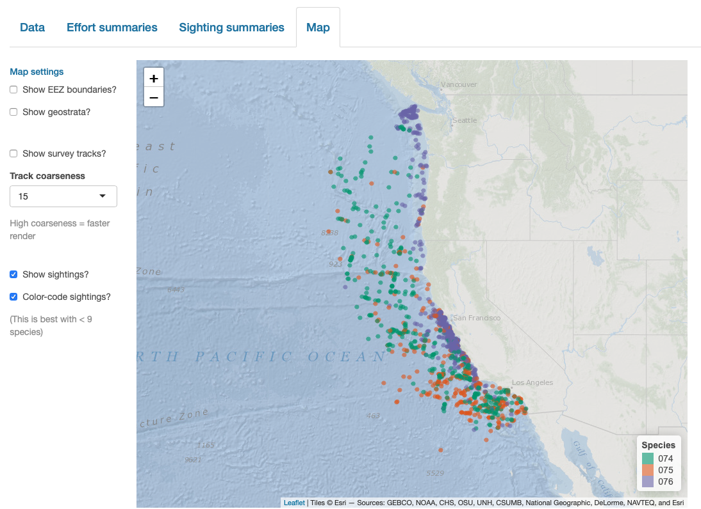

# Maps {#maps}

```{r, echo=FALSE, eval=TRUE, collapse=TRUE, include=FALSE}
library(dplyr)
library(LTabundR)

rerun_from_scratch <- FALSE
# If you want to confirm the package works, change to TRUE.
# If you already know it does, change to FALSE so that knitting is quick
# (it will use saved R objects instead of producing them anew)

```

To facilitate mapping with the processed data objects produced by `LTabundR`, we provide the following datasets and functions. These features are designed specifically for creating maps in `R` using the packages `ggplot()` and `sf`. 

## Creating a base map {-} 

All of the mapping functions in `LTabundR` are designed to be added onto a pre-existing map that you have already created with `ggplot2`, which itself has several functions that tie into the spatial functions in the package `sf`.  There are already several great resources out there for creating maps with `ggplot` and `sf`. ([Here is one example.](https://r-spatial.org/r/2018/10/25/ggplot2-sf.html)).   

```{r, echo=TRUE, eval=TRUE, collapse=TRUE, message=FALSE, warning=FALSE, fig.width=6, fig.height=4}
library(ggplot2)
library(sf)
library(LTabundR)
```

Here we provide a couple simple examples to demonstrate some of the spatial datasets that come with `LTabundR`. To begin, decide upon the CRS projection you wish to use for your map.  ([This website may be helpful.](https://www.pmassicotte.com/posts/2021-11-12-choosing-the-right-projection/)).  

```{r, echo=TRUE, eval=TRUE, collapse=TRUE, message=FALSE, warning=FALSE, fig.width=6, fig.height=4}
my_crs <- 4326
```

It will also be helpful to create objects for your desired geographic range, since you might need to refer to them multiple times:  

```{r, echo=TRUE, eval=TRUE, collapse=TRUE, message=FALSE, warning=FALSE, fig.width=6, fig.height=4}
xlims <- c(-162, -153)
ylims <- c(17, 24.2)
```

To create a simple map of the main Hawaiian islands, for example, you can use the `LTabundR` datasets named `"land"` and `"coastline"`, which are global datasets prepared using the `rnaturalearth` package, and the dataset `"eez_hawaii`, all of which have been provided as `sf` objects:    

```{r, echo=TRUE, eval=TRUE, collapse=TRUE, message=FALSE, warning=FALSE, fig.width=6, fig.height=4}
# Load dataset
data(land)
data(coastline)
data(eez_hawaii)

# Look at an example of structure
coastline %>% head

# Specify CRS
st_crs(coastline) <- my_crs
st_crs(land) <- my_crs
st_crs(eez_hawaii) <- my_crs
```

Now build a simple map, specifying the geographic range:

```{r, echo=TRUE, eval=TRUE, collapse=TRUE, message=FALSE, warning=FALSE, fig.width=6, fig.height=6}
p <- ggplot() + 
  geom_sf(data=land, fill='darkslategrey', color=NA, alpha=.6) + 
  geom_sf(data=coastline, color='darkslategrey', alpha=1, lwd=.2) + 
  geom_sf(data=eez_hawaii, color='grey50', alpha=.5, lwd=.4) + 
  coord_sf(xlim=xlims, ylim=ylims)

p
```

Remove some of the default features:  

```{r, echo=TRUE, eval=TRUE, collapse=TRUE, message=FALSE, warning=FALSE, fig.width=6, fig.height=6}
p <- p + 
  xlab(NULL) + ylab(NULL) +
  theme_light() +
  theme(strip.background = element_rect(fill = "grey45"),
        panel.grid.major = element_blank(),
        panel.grid.minor = element_blank())

p
```

Make it a bit fancier, using some functions from the package `ggspatial`:  

```{r, echo=TRUE, eval=TRUE, collapse=TRUE, message=FALSE, warning=FALSE, fig.width=6, fig.height=6}
p <- p + 
  ggspatial::annotation_north_arrow(location = "bl",
                                    which_north = "true",
                                    height = unit(1, 'cm'),
                                    width = unit(1, 'cm'),
                                    style = ggspatial::north_arrow_fancy_orienteering) +
  ggspatial::annotation_scale(location='br')
  
p
```

Now this base map is ready for some actual survey data!  We can use the built-in dataset for Pacific surveys, 1986 - 2020:  

```{r, echo=TRUE, eval=TRUE, collapse=TRUE, message=FALSE, warning=FALSE}
data("noaa_10km_1986_2020")
cruz <- noaa_10km_1986_2020
```

## Add stratum boundaries {-} 

Use the function `gg_geostratum()` to add geostratum boundaries from your `cruz` object to your map:  

```{r, echo=TRUE, eval=TRUE, collapse=TRUE, message=FALSE, warning=FALSE, fig.width=6, fig.height=6}
gg_geostratum(p, 
              cruz, 
              strata = c('MHI', 'WHICEAS')) + 
  # force limits to stay unchanged
  coord_sf(xlim=xlims, ylim=ylims) 
```

Here that function is again, demonstrating some of the optional inputs:  

```{r, echo=TRUE, eval=TRUE, collapse=TRUE, message=FALSE, warning=FALSE, fig.width=6, fig.height=6}
gg_geostratum(p, 
              cruz, 
              strata = c('MHI', 'WHICEAS'),
              color = c('darkorange', 'darkorchid'), 
              lty = 3,
              lwd = .5) + 
  # force limits to stay unchanged
  coord_sf(xlim=xlims, ylim=ylims)
```

## Add effort tracklines {-}

Before adding survey data, let's filter down to just the WHICEAS cruises from 2017 to 2020:  

```{r, echo=TRUE, eval=TRUE, collapse=TRUE, message=FALSE, warning=FALSE, fig.width=6, fig.height=6}
cruz_1720 <- 
  filter_cruz(cruz,
              eff_types = 'S',
              bft_range = 0:6,
              years = c(2017, 2020),
              regions = 'WHICEAS')
```

Now use the function `gg_effort()` to add effort tracklines  from your `cruz` object to your map:  

```{r, echo=TRUE, eval=TRUE, collapse=TRUE, message=FALSE, warning=FALSE, fig.width=6, fig.height=6}
gg_effort(p, cruz_1720)
```

To color code by Beaufort sea state:  

```{r, echo=TRUE, eval=TRUE, collapse=TRUE, message=FALSE, warning=FALSE, fig.width=6, fig.height=6}
gg_effort(p, 
          cruz_1720,
          color_by_bft = TRUE,
          alpha=.3)
```

Add faceting (you can use any column from the processed `DAS` data in subsequent `ggplot2` commands: 

```{r, echo=TRUE, eval=TRUE, collapse=TRUE, message=FALSE, warning=FALSE, fig.width=7, fig.height=4}
gg_effort(p, 
          cruz_1720,
          color_by_bft = TRUE,
          alpha=.3) + 
  facet_wrap(~year)
```


## Add sightings {-}

Use the function `gg_sightings()` to add sightings  from your `cruz` object to your map:  

```{r, echo=TRUE, eval=TRUE, collapse=TRUE, message=FALSE, warning=FALSE, fig.width=6, fig.height=6}
gg_sightings(p, cruz_1720, cex=2)
```

To plot detections of certain species only:  

```{r, echo=TRUE, eval=TRUE, collapse=TRUE, message=FALSE, warning=FALSE, fig.width=6, fig.height=6}
gg_sightings(p, cruz_1720, 
             spp = '076', 
             color='firebrick', 
             cex=2)
```

To color-code detections by species:  

```{r, echo=TRUE, eval=TRUE, collapse=TRUE, message=FALSE, warning=FALSE, fig.width=6, fig.height=6}
gg_sightings(p, cruz_1720, 
             spp = c('076', '046'), 
             color_by_spp = TRUE,
             cex = 2,
             alpha = 1,
             pch = 15)
```

To translate species codes to full common names, you can supply a `data.frame` with the necessary translation information. `LTabundR` comes with a built-in dataset for Pacific species, `"species_codes"`.  

```{r, echo=TRUE, eval=TRUE, collapse=TRUE, message=FALSE, warning=FALSE, fig.width=6, fig.height=6}
data(species_codes)

gg_sightings(p, cruz_1720, 
             spp = c('076', '046'), 
             spp_translate = species_codes,
             color_by_spp = TRUE,
             alpha = .8,
             cex = 2)
```


## Other base maps {-}

### Hawaiian EEZ {-} 

```{r, echo=TRUE, eval=TRUE, collapse=TRUE, message=FALSE, warning=FALSE, fig.width=6, fig.height=6}
# Under construction!
```


### California Current System {-}

```{r, echo=TRUE, eval=TRUE, collapse=TRUE, message=FALSE, warning=FALSE, fig.width=6, fig.height=6}
# Under construction!
```


### Eastern tropical Pacific {-}

```{r, echo=TRUE, eval=TRUE, collapse=TRUE, message=FALSE, warning=FALSE, fig.width=6, fig.height=6}
# Under construction!
```


### Marianas archipelago {-}

```{r, echo=TRUE, eval=TRUE, collapse=TRUE, message=FALSE, warning=FALSE, fig.width=6, fig.height=6}
# Under construction!
```


## Interactive maps {-}

`LTabundR` also has an interactive map function, which maps survey data using the `leaflet` package.  

```{r, echo=TRUE, eval=FALSE, collapse=TRUE, message=FALSE, warning=FALSE, fig.width=6, fig.height=4}
map_cruz(cruz_1720,
          cohort=1,
          eez_show=FALSE,
          strata_show=FALSE,
          effort_show=TRUE,
          effort_resolution=1,
          sightings_show=TRUE,
          sightings_color = 'firebrick',
          verbose=FALSE)
```

Note that you can also click on sightings and tracklines to see their details. Refer to the documentation for this function (`?map_cruz`) to see all the options available for stylizing these maps.

## Interactive dashboard {-}

Finally, note that `LTabundR` comes with an interactive data explorer app (a `Shiny` app) for filtering survey data according to effort scenario and species code, toggling `map_cruz()` settings, and reviewing summary tables of effort and sightings (including inspection of truncation distances). 

```{r, echo=TRUE, eval=FALSE, collapse=TRUE, message=FALSE, warning=FALSE, fig.width=6, fig.height=4}
cruz_explorer(cruz)
```

*Screenshots from this app:*

&nbsp;  
<center>
{width=85%}
&nbsp;  
{width=85%}
&nbsp;  
{width=85%}
&nbsp;  
{width=85%}
&nbsp;  
{width=85%}
</center>


