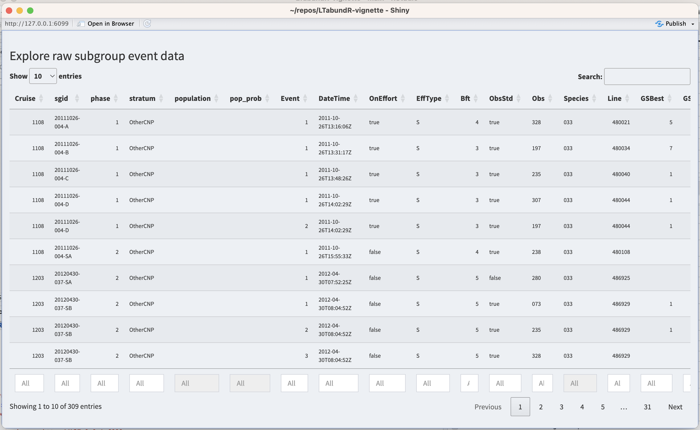

# Subgroup-based analysis {#subgroups2}

```{r, echo=FALSE, eval=TRUE, collapse=TRUE, include=TRUE, warning=FALSE, message=FALSE}
library(dplyr)
library(magrittr)
library(ggplot2)
library(LTabundR)

rerun_from_scratch <- FALSE
# If you want to confirm the package works, change to TRUE.
# If you already know it does, change to FALSE so that knitting is quick
# (it will use saved R objects instead of producing them anew)
```

False killer whales (*Pseudorca crassidens*) are rare and occur in dispersed subgroups, which complicates conventional distance sampling approaches to line-transect analysis ([Bradford et al. 2014](https://journals.plos.org/plosone/article?id=10.1371/journal.pone.0090464)). To better estimate their abundance in Hawaiian waters, the Pacific Islands Fisheries Science Center initiated a sub-group protocol referred to as the "PC Protocol", a reference to the species' scientific name. Data collected using the PC Protocol is then analyzed using a subgroup-based analytical approach ([Bradford et al. 2014](https://journals.plos.org/plosone/article?id=10.1371/journal.pone.0090464), [2020](https://repository.library.noaa.gov/view/noaa/24756)).  


An additional complication is that false killer whales in Hawaiian waters belong to three discrete populations -- the Main Hawaiian Islands insular population, the Northwestern Hawaiian Islands (NWHI) population, and a pelagic population -- whose ranges partially overlap, which means that population assignment cannot always be based simply on the geographic location of sightings. When geographic assignment of population is not possible, biopsy-sampled genetics or photo-identification inference, if available, is used to assign each sighting to a population *post-hoc*.  

To accommodate these special circumstances for false killer whales (and potentially other species with subgroup structure) with an appropriate balance of flexibility and efficiency, `LTabundR` includes a function named `lta_subgroup()`, whose use will look something like this: 

```{r, echo=TRUE, eval=FALSE, collapse=TRUE, message=FALSE, warning=FALSE}
lta_subgroup(df_sits,
             truncation_distance,
             ss,
             density_segments,
             density_das,
             density_sightings,
             Rg0= NULL, 
             cruz10 = NULL,
             g0_spp = NULL,
             g0_truncation = NULL,
             g0_constrain_shape = FALSE,
             g0_jackknife_fraction = 0.1,
             abundance_area = NULL,
             iterations = 5000,
             seed = NULL,
             output_dir = NULL,
             toplot = TRUE,
             verbose = TRUE
```

Note that there are several required inputs (without any defaults) as well as many optional inputs (with defaults provided).   

We will step through each of these inputs below, using a case study in which we estimate the abundance of the pelagic false killer whale population in the Hawaiian EEZ for 2017 ([Bradford et al. 2020](https://repository.library.noaa.gov/view/noaa/24756)). 

### Refresher on data processing {-} 

`LTabundR` has been designed to make a first-pass attempt at processing subgroup data resulting from the PC protocol. We recommend that you review the details of [how subgroup data are processed](#subgroups) within the `LTabundR` framework. For convenience, below we provide the minimum data processing code needed to reproduce the analysis we present here. 

```{r, echo=TRUE, eval=TRUE, collapse=TRUE, message=FALSE, warning=FALSE}
# Local path to DAS file
das_file <- 'data/surveys/CenPac1986-2020_Final_alb.das'
```

```{r, echo=TRUE, eval=TRUE, collapse=TRUE, message=FALSE, warning=FALSE}
# Strata to use
data(strata_cnp)
strata_cnp %>% names

my_strata <- strata_cnp[c(1, 2, 11, 12)]
my_strata %>% names
```

```{r, echo=TRUE, eval=TRUE, collapse=TRUE, message=FALSE, warning=FALSE}
# Survey-wide settings
data(species_codes)
data(ships)
data(group_size_coefficients)
survey <- load_survey_settings(
  out_handling = 'remove',
  min_row_interval = 2,
  max_row_interval = 3600,
  max_row_km = 100,
  km_filler = 1,
  speed_filler = 10 * 1.852,
  segment_method = "equallength",
  segment_target_km = 150,
  segment_max_interval = 24,
  segment_remainder_handling = c("segment"),
  ship_list = ships,
  species_codes = species_codes,
  group_size_coefficients = group_size_coefficients,
  smear_angles = FALSE)
```

```{r, echo=TRUE, eval=TRUE, collapse=TRUE, message=FALSE, warning=FALSE}
# Cohort-specific settings
all_species <- load_cohort_settings(
  id = "all", 
  probable_species = FALSE,
  sighting_method = 0,
  cue_range = 0:7,
  school_size_range = c(0, 10000),
  school_size_calibrate = TRUE,
  calibration_floor = 0,
  use_low_if_na = TRUE, 
  io_sightings = 0,
  geometric_mean_group = TRUE,
  truncation_km = 7.5, 
  beaufort_range = 0:6,
  abeam_sightings = FALSE, 
  strata_overlap_handling = c("smallest"),
  distance_types = c('S','F','N'),
  distance_modes = c('P','C'),
  distance_on_off = TRUE)
```

```{r, echo=TRUE, eval=rerun_from_scratch, collapse=TRUE, message=FALSE, warning=FALSE}
# Gather settings
settings <- load_settings(strata = my_strata,
                          survey = survey,
                          cohorts = list(all_species))

# Process data
cruz <- process_surveys(das_file, 
                        settings)
```

```{r, echo=FALSE, eval=rerun_from_scratch, collapse=TRUE, message=FALSE, warning=FALSE}
save(cruz, file='subgroup_cruz_og.RData')
```

```{r, echo=FALSE, eval=TRUE, collapse=TRUE, message=FALSE, warning=FALSE}
load('subgroup_cruz_og.RData')
```

This `cruz` object has the geostrata relevant to the subgroup analysis we are replicating here: 

```{r, echo=TRUE, eval=TRUE, collapse=TRUE, message=FALSE, warning=FALSE}
cruz$strata
```

The `all` cohort for this `cruz` object has a `subgroups` slot...

```{r, echo=TRUE, eval=TRUE, collapse=TRUE, message=FALSE, warning=FALSE}
cruz$cohorts$all %>% names
```

... which has three slots inside it: 

```{r, echo=TRUE, eval=TRUE, collapse=TRUE, message=FALSE, warning=FALSE}
cruz$cohorts$all$subgroups %>% names
```

The `events` slot is the closest thing to raw `DAS` data: each row is a subgroup size estimate from a single observer. The `subgroups` slot has a line for each subgroup, with the subgroup size averaged across observers. The `sightings` slot has a line for each sighting within each phase of the PC protocol, with group size representing the sum of all subgroups in the respective phase.   

Here are all the columns within the `events` slot: 

```{r, echo=TRUE, eval=TRUE, collapse=TRUE, message=FALSE, warning=FALSE}
cruz$cohorts$all$subgroups$events %>% names
```

Note that each subgroup has automatically been assigned to a phase of the PC protocol: 

```{r, echo=TRUE, eval=TRUE, collapse=TRUE, message=FALSE, warning=FALSE}
cruz$cohorts$all$subgroups$events$phase %>% head(20)
```

And that each subgroup has been given a blank placeholder of `NA` in the population column: 

```{r, echo=TRUE, eval=TRUE, collapse=TRUE, message=FALSE, warning=FALSE}
cruz$cohorts$all$subgroups$events$population %>% head()
```


## Manual data updates {-}  

In most cases the processed subgroup data will need to be reviewed carefully and it is probable that some manual edits will be necessary. To facilitate that process, `LTabundR` offers functions that allow the user to review the processed data, stage reproducible edits using code, and re-process the data to apply those edits.   

In short, here are the functions related to each step in this editing workflow: 

(1) To review the default processing applied to the subgroup data when you ran `process_surveys()`, use the function **`subgroup_explorer()`**.  

(2) To edit the way subgroup data are processed -- e.g., assigning detections to certain populations or changing the phase of the PC protocol for a detection -- use the functions **`subgroup_populations()`** and **`subgroup_edits()`**.  Collect the outputs of those functions into a `list`, then ...  

(3) To re-process the subgroup data with your `list` of staged edits, run **`process_subgroups()`** and pass your `list` to the input named `edits`.  


We provide details for each of those steps in the following subsections.  


### Reviewing processed subgroup data {-} 

For reviewing processed subgroup data, use the **`subgroup_explorer()`** function. 

```{r, echo=TRUE, eval=FALSE, collapse=TRUE, message=FALSE, warning=FALSE}
subgroup_explorer(cruz, cohort='all')
```

This function launches an interactive `Shiny` dashboard for exploring the processed subgroups `events`. It will look like this: 

{width=95%}

To stage code for reproducible edits to the processed data, two functions are available: `subgroup_populations()` and `subgroup_edits()`. We review those functions below, then show how to apply those coded edits by re-processing the subgroup data.  

### Staging subgroup edits {-} 

#### `subgroup_populations()` {-} 

The function `subgroup_populations()` allows you to batch-assign subgroup events to certain populations based upon spatial polygons. Its use looks like this: 

```{r, echo=TRUE, eval=FALSE, collapse=TRUE, message=FALSE, warning=FALSE}
subgroup_populations(populations,
                     cruz,
                     cohort='all',
                     default_pop = 'pelagic')
```

In this function, the `populations` input is a named list of polygon coordinates, very similar to the way `strata` are supplied in the settings for `process_surveys()`. Here's an example of what that list could look like if you chose to use some of the strata in your `cruz` `settings`:  

```{r, echo=TRUE, eval=TRUE, collapse=TRUE, message=FALSE, warning=FALSE}
# Pull polygons from settings
mhi_fkw <- cruz$settings$strata$mhi_fkw
nwhi_fkw <- cruz$settings$strata$nwhi_fkw

# Example of data structure
mhi_fkw %>% head 

# Create populations object
populations <- list(MHI = mhi_fkw,
                    NWHI = nwhi_fkw)
```

The name of each list slot will be treated as the name of the population occurring within the respective polygon.  When we used these polygons as the population boundaries, we get the following variety of population assignments and probabilities:  

```{r, echo=TRUE, eval=TRUE, collapse=TRUE, message=FALSE, warning=FALSE}
pops <- 
  subgroup_populations(populations, 
                       cruz, 
                       cohort = 'all', 
                       default_pop = 'pelagic')

pops$population %>% table

pops$pop_prob %>% table
```

When you run the function `subgroup_populations()`, it returns a `data.frame` of instructions in which each row is a population assignment for a subgroup event:  

```{r, echo=TRUE, eval=TRUE, collapse=TRUE, message=FALSE, warning=FALSE}
subgroup_populations(populations,
                     cruz,
                     cohort='all',
                     default_pop = 'pelagic',
                     verbose=FALSE) %>% head
```

This `data.frame` is formatted exactly as needed to pass these edits to the re-processing routine `process_subgroups()`, as shown below.  The column `population` contains the population assignment, and `pop_prob` contains the probability that the event is assigned to this population. The latter will be `1.0` unless the event occurs in overlapping polygons, in which case the `population` column will display all eligible population names separated by a semicolon (e.g., if there are two overlapping polygons named `"MHI"` and `"NWHI"`, the `population` will be shown as `"MHI;NWHI"`), and the `pop_prob` column will display an equal probability of assignment for each of those populations (e.g., `"0.5;0.5"`). If an event does not occur within any of the polygons provided, it will be given the `default_pop` name, with a default `pop_prob` of `1.0`.    

Note that if your data do not have population structure, you can skip this step and proceed. 


#### Stage specific edits {-}

To manually stage specific edits to the processed subgroup data, use the `subgroup_edits()` function. Its use will look something like this, though the latter inputs depend on the type of edit you are staging: 

```{r, echo=TRUE, eval=FALSE, collapse=TRUE, message=FALSE, warning=FALSE}
subgroup_edits(cohort = 'all',
               sgid = '1108-20111026-004-A',
               ...) # remaining inputs depend on the type of edit
```

The input `sgid` refers to the unique subgroup ID assigned, which you can find when you look at the subgroup data with `subgroup_explorer()` (described above). You can supply a single `sgid` or a vector of `sgid values.   

This `subgroup_edits()` function returns a `list` of staged edits that can be passed directly to the subgroup re-processing routine we explain further below. 


##### Edit population {-}

If you need to fix population assignments on a case-by-case basis after using the batch-assignment function, `subgroup_populations()` discussed above, use the following syntax:  

```{r, echo=TRUE, eval=FALSE, collapse=TRUE, message=FALSE, warning=FALSE}
subgroup_edits(cohort = 'all',
               sgid = '1108-20111026-004-A',
               population = 'MHI;NWHI',
               pop_prob = '0.5;0.5')
```

The `population` input takes a character vector, with length of either 1 or the same as `sgid`, indicating the new population(s) to assign the `sgid`(s). If you want a `sgid` to be eligible for multiple populations, separate the population names with a semicolon. Both this input and `pop_prob` needs to be provided in order for the edit to work properly. 

The `pop_prob` input takes a vector, with length of either 1 or the same as `sgid` and values ranging between 0 and 1, indicating the probability of each population assignment for the `sgid`(s). If you want a `sgid` to be eligible for multiple populations, provide a character vector and separate the probabilities by a semicolon, e.g., `"0.5;0.5"`. Both this input and `population` need to be provided in order for the edit to work properly.  


##### Edit phases {-}

If you need to fix the phase assignment for subgroup event(s), use the following syntax:  

```{r, echo=TRUE, eval=FALSE, collapse=TRUE, message=FALSE, warning=FALSE}
subgroup_edits(cohort = 'all',
               sgid = '1108-20111026-004-A',
               phase = 2)
```

The input `phase` takes a numeric vector, with length of either 1 or the same as `sgid`, indicating the new phase to assign the `sgid`(s). If you wish to remove a phase assignment for a `sgid`, use `NA`.

##### Edit primary observer {-}

If you want to control whether a subgroup event was seen by the primary/standard observer (the column `ObsStd` is either `TRUE` or `FALSE`), use the following syntax:  

```{r, echo=TRUE, eval=FALSE, collapse=TRUE, message=FALSE, warning=FALSE}
subgroup_edits(cohort = 'all',
               sgid = '1108-20111026-004-A',
               ObsStd = TRUE)
```

The input `ObsStd` takes a Boolean vector, with length of either 1 or the same as `sgid`, indicating the value for `ObsStd` for each `sgid`. 


##### Remove/exclude subgroup {-} 

In rare cases you may need to delete a subgroup so that it does not affect any aspect of the analysis. To do so, use this syntax:  

```{r, echo=TRUE, eval=FALSE, collapse=TRUE, message=FALSE, warning=FALSE}
subgroup_edits(cohort = 'all',
               sgid = '1108-20111026-004-A',
               exclude = TRUE)
```

The input `exclude` takes a Boolean vector, with length of either 1 or the same as `sgid`, indicating which `sgid`(s) to erase: `TRUE` means exclude, `FALSE` means keep. We recommend implementing these edits last, since the removal of a row of data may have downstream effects on how other edits are applied.  


#### Re-processing subgroup data {-}

Here is an arbitrary example of how a set of staged edits may look in your code:  

```{r, echo=TRUE, eval=FALSE, collapse=TRUE, message=FALSE, warning=FALSE}
# Batch-edit population assignments ========
mhi_fkw <- cruz$settings$strata$mhi_fkw
nwhi_fkw <- cruz$settings$strata$nwhi_fkw
new_pops <- subgroup_populations(populations = list(MHI = mhi_fkw, 
                                                    NWHI = nwhi_fkw), 
                                 cruz, 
                                 cohort = 'all', 
                                 default_pop = 'pelagic')

# Case-by-case edits =======================
cohort <- 'all'

# Population changes
edit1 <- subgroup_edits(cohort=cohort, 
                        sgid = '1108-20111026-004-A',
                        population = 'space whales', 
                        pop_prob = '1')

# Phase changes
edit2 <- subgroup_edits(cohort=cohort, 
                        sgid = '1108-20111026-004-D',
                        phase = 2)

# Multiple changes to same sgid
edit3 <- subgroup_edits(cohort=cohort, 
                        sgid = '1108-20111026-004-C',
                        phase=2,
                        population = 'space whales', 
                        pop_prob = '1'),
# Exclusion
edit4 <- subgroup_edits(cohort=cohort, 
                        sgid = '1108-20111026-004-D',
                        exclude = TRUE))
```

Now that you have these edits staged, you can put them into a `list `and re-process your subgroup data using the function `process_subgroups()`:

```{r, echo=TRUE, eval=FALSE, collapse=TRUE, message=FALSE, warning=FALSE}
edits <- list(new_pops, edit1, edit2, edit3, edit4)

cruz_revised <- process_subgroups(cruz, edits = edits)
```

You can use the `subgroup_explorer()` function to verify that changes were applied as intended.  

We will use most of these functions in the code below that prepares inputs for the `lta_subgroups()` function to replicate the false killer whale abundance estimates from HICEAS 2017 ([Bradford et al. 2020](https://repository.library.noaa.gov/view/noaa/24756)).  

## Inputs to `lta_subgroup()` {-}  

### `df_sits` {-}  

This is a `data.frame` of sightings you want to use to fit the detection function model. For false killer whales in [Bradford et al. (2020)](https://repository.library.noaa.gov/view/noaa/24756), this is a combination of filtered sightings prior to 2011 (made without the PC protocol, but where the sighting was considered to represent the first subgroup detection) and "Phase 1" subgroup detections from 2011 onwards (using the PC protocol). No filtering will be applied to these sightings within this function, so make sure you provide the data pre-filtered. [Bradford et al. (2020)](https://repository.library.noaa.gov/view/noaa/24756) used a single detection function for all populations of false killer whales. 

This dataset needs to be filtered for use in the detection function model. On-Effort sightings from 1986-2010 were eligible for use, specifically: `OnEffort` is `TRUE`, `EffType` can be `"S"`, `"F"`, or `"N"`; no mixed-species schools; no sightings past beam; and only detections made by a primary observer.  

Here we draw those sightings from the above `cruz` object, filtering as needed, and to simplify we will select only a few key columns.     

```{r, echo=TRUE, eval=TRUE, collapse=TRUE, message=FALSE, warning=FALSE}
# Start with a safe copy
cruz_df <- cruz
```

```{r, echo=TRUE, eval=TRUE, collapse=TRUE, message=FALSE, warning=FALSE}
sits_1986_2010  <-
  cruz_df$cohorts$all$sightings %>%
  filter(OnEffort == TRUE,
         year >= 1986,
         year <= 2010,
         OnEffort == TRUE,
         EffType %in% c('S', 'F', 'N'), 
         species == '033', # code for false killer whales
         ObsStd == TRUE,
         mixed == FALSE,
         Bearing <= 90 | Bearing >= 270) %>%
  select(DateTime, Lat, Lon, Cruise, PerpDistKm) %>% 
  arrange(DateTime)
```

```{r, echo=TRUE, eval=TRUE, collapse=TRUE, message=FALSE, warning=FALSE}
sits_1986_2010 %>% nrow
```

```{r, echo=FALSE, eval=TRUE, collapse=TRUE, message=FALSE, warning=FALSE}
row.names(sits_1986_2010) <- NULL
```

```{r, echo=TRUE, eval=TRUE, collapse=TRUE, message=FALSE, warning=FALSE}
sits_1986_2010 %>% head
```

We add one sighting from 2016 that is going to be treated like a pre-2011 sighting, since it was not made with the PC protocol: 

```{r, echo=TRUE, eval=TRUE, collapse=TRUE, message=FALSE, warning=FALSE}
sit_1604_018 <- 
  cruz_df$cohorts$all$sightings %>% 
  filter(Cruise == 1604, 
         SightNo == '018') %>% 
  select(DateTime, Lat, Lon, Cruise, PerpDistKm)
```

```{r, echo=FALSE, eval=TRUE, collapse=TRUE, message=FALSE, warning=FALSE}
row.names(sit_1604_018) <- NULL
```

```{r, echo=TRUE, eval=TRUE, collapse=TRUE, message=FALSE, warning=FALSE}
sit_1604_018
```

To add to this pool of sightings, we also include Phase 1 subgroup detections from 2011 to 2017 based on the PC protocol. Specific criteria: PC Protocol is `Phase 1`, `OnEffort` is `TRUE`,  `EffType` can be `"S"`, `"F"`, or `"N"`; no mixed-species schools; no sightings past beam; detection made by primary observer.   
    
Before we apply these filters, we need to make a few edits for a some special cases:  

```{r, echo=TRUE, eval=TRUE, collapse=TRUE, message=FALSE, warning=FALSE}
# These subgroups should have a standard observer 
# according to ALB et al. (2020):
edit1 <- subgroup_edits(cohort = 'all', 
                        sgid = '1705-20170912-056-B',
                        ObsStd = TRUE)

edit2 <- subgroup_edits(cohort = 'all', 
                        sgid = '1706-20170727-039-D',
                        ObsStd = TRUE)

edit3 <- subgroup_edits(cohort = 'all', 
                        sgid = '1706-20170912-119-K',
                        ObsStd = TRUE)

edit4 <- subgroup_edits(cohort = 'all', 
                        sgid = '1705-20170929-073-C',
                        ObsStd = TRUE)

# This subgroup was found to be a mixed-species after the fact
# so it is excluded from the dataset:
edit5 <- subgroup_edits(cohort = 'all', 
                        sgid = '1203-20120513-069-A',
                        exclude = TRUE)

# Now update the cruz object with these edits
edits <- list(edit1, edit2, edit3, edit4, edit5)
cruz_df <- process_subgroups(cruz_df, edits = edits)
```

```{r, echo=FALSE, eval=FALSE, collapse=TRUE, message=FALSE, warning=FALSE}
# SCRATCHPAD
cruz_df$cohorts$all$subgroups$events %>% 
  filter(Cruise == 1705, 
         SightNo == '073',
         SubGrp == 'C') %>% 
  as.data.frame
```
  
Now apply filter: 

```{r, echo=TRUE, eval=TRUE, collapse=TRUE, message=FALSE, warning=FALSE}
sits_2011_2017  <-
  cruz_df$cohorts$all$subgroups$subgroups %>%
  filter(OnEffort == TRUE,
         lubridate::year(DateTime) >= 2011,
         lubridate::year(DateTime) <= 2017,
         ObsStd == TRUE,
         Angle <= 90 | Angle >= 270,
         Species == '033',
         Phase == 1) %>%
  select(DateTime, Lat, Lon, Cruise, PerpDistKm = PerpDist) %>% 
  arrange(DateTime)
  
sits_2011_2017 %>% nrow

sits_2011_2017 %>% head
```

To create `df_sits` for detection function fitting, we combine these datasets together:  

```{r, echo=TRUE, eval=TRUE, collapse=TRUE, message=FALSE, warning=FALSE}
df_sits <- rbind(sits_1986_2010, 
                 sit_1604_018,
                 sits_2011_2017)
df_sits %>% nrow
```

To check that this sample size matches that used in [Bradford et al. 2020](https://repository.library.noaa.gov/view/noaa/24756) (n=100), we can preliminarily filter this set of sightings to those whose perpendicular distance from the trackline is within 4.5 km (see the next section for how this was determined).  

```{r, echo=TRUE, eval=TRUE, collapse=TRUE, message=FALSE, warning=FALSE}
df_sits %>% filter(PerpDistKm <= 4.5) %>% nrow
```


### `truncation_distance` {-}  

The truncation distance, in km, will be applied during detection function model fitting. Typically the farthest 5 - 10% of sightings are truncated, but this needs to be balanced by sample size considerations.  

Tabulate detection distances using a `LTabundR` function:  

```{r, echo=TRUE, eval=TRUE, collapse=TRUE, message=FALSE, warning=FALSE, fig.height=4, fig.width=7}
dists <- 
  summarize_distances(df_sits$PerpDistKm) %>% 
  select(-total_within)

dists
```

Plot these options:  

```{r, echo=TRUE, eval=TRUE, collapse=TRUE, message=FALSE, warning=FALSE, fig.height=4, fig.width=7}
ggplot(dists, aes(x=km_max_excl, y=percent_beyond)) + 
  geom_point() + geom_path() + 
  geom_hline(yintercept = 10, lty=2, color='firebrick') + 
  ylab('Percent of sightings beyond this distance') +
  xlab('Perpendicular distance (km)') + 
  scale_x_continuous(n.breaks = 10) + 
  scale_y_continuous(limits = c(0, 100), n.breaks = 10) 
```

Based on these results, we will choose a truncation distance of 4.5 km. 

```{r, echo=TRUE, eval=TRUE, collapse=TRUE, message=FALSE, warning=FALSE}
truncation_distance <- 4.5
```

### `ss` {-}  

This is a numeric vector of subgroup sizes. The function will find this vector's arithmetic mean and bootstrapped CV. In [Bradford et al. (2020)](https://repository.library.noaa.gov/view/noaa/24756), these data come from Phase 1 and Phase 2 estimates of subgroup sizes from 2011 onwards. In the processed `cruz` object, each of those estimates is the geometric mean of repeat estimates from separate observers.  


Some of these estimates need to be removed for various reasons that were not captured in processing the `DAS` file. However, these subgroups may only need to be removed from the dataset used for subgroup size estimation -- they may still be used in `df_sits` and other inputs as long as their details meet the respective criteria of each parameter. The vectors below provide the subgroup ID's that should be removed for the purposes of subgroup size estimation:  

```{r, echo=TRUE, eval=TRUE, collapse=TRUE, message=FALSE, warning=FALSE}
# Subgroup sighted by non-primary observer
missed_by_primary <- c('1706-20170912-119-M',
                       '1706-20170912-119-P',
                       '1706-20170913-122-C',
                       '1705-20170913-122-E',
                       '1706-20170917-133-G')

# Subgroup occurred in a mixed species sighting
mixed_spp <- c("1203-20120513-069-A",
               "1203-20120513-069-SB",
               "1203-20120513-069-SC",
               "1203-20120513-069-ZA",
               "1203-20120513-069-ZC")

# Phase assignments compromised
phase_compromised <- c("1303-20130526-059-B",
                       "1303-20130526-059-C",
                       "1303-20130526-059-D",
                       "1604-20160704-018-A",
                       "1705-20170820-016-A",
                       "1705-20170911-055-SA",
                       "1705-20171009-086-A",
                       "1705-20171102-116-A",
                       "1705-20171102-116-B",
                       "1705-20171117-136-A")

# Subgroup fluidity
subgroup_fluidity <- c('1203-20120516-076-SA')

```

We first remove these subgroup IDs from the raw subgroup data, found in the `events` slot in the `subgroups` slot of the `cruz` cohort:  

```{r, echo=TRUE, eval=TRUE, collapse=TRUE, message=FALSE, warning=FALSE}
events <- cruz$cohorts$all$subgroups$events

events <- events %>% filter(! sgid %in% missed_by_primary,
                            ! sgid %in% mixed_spp,
                            ! sgid %in% phase_compromised,
                            ! sgid %in% subgroup_fluidity)
```

We then use the `LTabundR` function `subgroup_subgroups()` to turn these observer-species estimates into a single row for each subgroup, with subgroup sizes averaged using the geometric mean:  

```{r, echo=TRUE, eval=TRUE, collapse=TRUE, message=FALSE, warning=FALSE}
subgroups <- subgroup_subgroups(events)
```

We can then use these subgroups to conduct additional filtering for each phase of the PC protocol. Phase 1 detections need to be within 4.5km, not past the beam, and made by a primary observer with a valid "best" estimate.  Phase 2 detections need to be within 4.5km and have a valid "best" estimate.

```{r, echo=TRUE, eval=TRUE, collapse=TRUE, message=FALSE, warning=FALSE}
# Filters that apply to both phases
ss  <-
  subgroups %>% 
  filter(lubridate::year(DateTime) >= 2011,
         lubridate::year(DateTime) <= 2017,
         GSBest_geom_valid == TRUE,
         stratum_OtherCNP == TRUE,
         Species == '033',
         PerpDist <= 4.5) 
```

```{r, echo=TRUE, eval=TRUE, collapse=TRUE, message=FALSE, warning=FALSE}
# Additional Phase 1 filters
ss_phase1 <- 
  ss %>% 
  filter(Phase == 1,
         Angle <= 90)

# (Ideally, ObsStd == TRUE would have been used to filter 
# for primary observer sightings, but the way data were collected 
# for a couple of sightings necessitated the manual way above)

ss_phase1 %>% nrow
```

```{r, echo=TRUE, eval=TRUE, collapse=TRUE, message=FALSE, warning=FALSE}
# Additional Phase 2
ss_phase2 <- 
  ss %>% 
  filter(Phase == 2)

ss_phase2 %>% nrow
```

```{r, echo=TRUE, eval=TRUE, collapse=TRUE, message=FALSE, warning=FALSE}
# Combine
ss <- rbind(ss_phase1, ss_phase2) 
```

```{r, echo=TRUE, eval=TRUE, collapse=TRUE, message=FALSE, warning=FALSE}
# Pull out group size vector
ss <- ss %>% pull(GSBest_geom)

# Check sample size
ss %>% length

ss
```

The sample size in [Bradford et al. (2020)](https://repository.library.noaa.gov/view/noaa/24756) is n=127 (63 from phase 1, 64 from phase 2).  


### `Rg0` {-}  

This is a `data.frame` with estimates of Relative *g(0)* and its CV at each Beaufort sea state. If this input is left `NULL`, then these estimates will be produced by the function using the subsequent `g0_` inputs below. If this input is *not* supplied and any of the subsequent `g0_` inputs are missing, then *g(0)* will be assumed to be 1.0 with CV of 0.0.  

When you do supply this `Rg0` input, the `data.frame` has three required columns: `bft` (Beaufort sea state, numbers between 0 and 6), `Rg0` (*Rg(0)* estimates for each Beaufort state), and `Rg0_CV` (the CV of the *Rg(0)* estimate in each Beaufort state). Other columns are allowed but will be ignored. 

Here is an example of a valid `Rg0` input based on the values reported for false killer whales in [Bradford et al. (2020)](https://www.fisheries.noaa.gov/inport/item/59592).  (These numbers are also available in the built-in dataset `data(barlow_2015)`). 

```{r, echo=TRUE, eval=TRUE, collapse=TRUE, message=FALSE, warning=FALSE}
Rg0 <- data.frame(bft = 0:6,
                  Rg0 = c(1, 1, 0.72, 0.51, 0.37, 0.26, 0.19),
                  Rg0_CV = c(0, 0, 0.11, 0.22, 0.34, 0.46, 0.59))

Rg0
```

Again: if you supply this input, then the following `g0_` inputs will be ignored. 

### `cruz10` {-}  

This is a processed `cruz` object with short segment lengths, ideally 10 km or less (hence the 10 in the input name). This `cruz` object will be used to estimate *Rg(0)*, i.e., the relative trackline detection probability (see its chapter), using the following `g0_` inputs. The built-in dataset we have already loaded, `data("noaa_10km_1986_2020")` is already processed with 10-km segments.  

```{r, echo=TRUE, eval=TRUE, collapse=TRUE, message=FALSE, warning=FALSE}
cruz10 <- cruz
```

### `g0_spp` {-}  

This and the following `g0_` inputs will be used to model Relative *g(0)* estimates and their CV in various Beaufort sea states. If the previous input, `Rg0` is provided, then these `g0_` inputs will be ignored, and no *Rg(0)* modeling will take place. Furthermore, if any of these `g0_` inputs are not provided, *Rg(0)* will be coerced to 1.0 with a CV of 0.0 for all sea states.  

This input, `g0_spp`, is a character vector of species code(s) to use to estimate *Rg(0)*. In most cases this will be a single species, e.g., `"033"` for false killer whales.  

```{r, echo=TRUE, eval=TRUE, collapse=TRUE, message=FALSE, warning=FALSE}
g0_spp <- '033'
```

### `g0_truncation` {-}  

The truncation distance to use when estimating *Rg(0)*. In [Bradford et al. (2020)](https://repository.library.noaa.gov/view/noaa/24756) this is 5.5 km.  

```{r, echo=TRUE, eval=TRUE, collapse=TRUE, message=FALSE, warning=FALSE}
g0_truncation <- 5.5
```

### `g0_constrain_shape` {-}  

Some *Rg(0)* curves will not decline monotonically due to sample size issues at low Bft (0-2) or high Bft (5-6) states. To coerce monotonic decline, set this input to `TRUE`, and the function will use a shape-constrained GAM (`scam()` from package `scam`) instead of a classic `mgcv::gam()`.

```{r, echo=TRUE, eval=TRUE, collapse=TRUE, message=FALSE, warning=FALSE}
g0_constrain_shape = FALSE
```

### `g0_jackknife_fraction` {-}  

The proportion of data to leave out within each jackknife permutation. The default is `0.1` (i.e., 10% of the data, yielding 10 jackknife loops), after [Barlow (2015)](https://onlinelibrary.wiley.com/doi/abs/10.1111/mms.12205).  

```{r, echo=TRUE, eval=TRUE, collapse=TRUE, message=FALSE, warning=FALSE}
g0_jackknife_fraction = 0.1
```

### `density_segments` {-}  

The survey segments to be used in density/abundance estimation. For example, [Bradford et al. (2020)](https://repository.library.noaa.gov/view/noaa/24756) used 150-km segments to estimate false killer whale density in the Hawaiian EEZ in 2017. For this we can use the same `cruz` we processed above and have been using throughout this chapter.  

Note that no filtering will be applied to these segments by the `lta_subgroup()` function, so we need to filter them ourselves first: we want only systematic-effort segments for the Hawaiian EEZ in 2017 (specifically, just cruises 1705 and 1706).  

```{r, echo=TRUE, eval=TRUE, collapse=TRUE, message=FALSE, warning=FALSE}
cruzi <- filter_cruz(cruz = cruz,
                      analysis_only = TRUE,
                      years = 2017,
                      cruises = c(1705, 1706),
                      regions = 'HI_EEZ',
                      bft_range = 0:6,
                      eff_types = 'S',
                      on_off = TRUE)
```

At this point we need to batch-assign detections to their respective populations. To do so, we draw stock boundary polygons from the `cruz` strata:  

```{r, echo=TRUE, eval=TRUE, collapse=TRUE, message=FALSE, warning=FALSE}
mhi <- cruz$settings$strata$mhi_fkw
nwhi <- cruz$settings$strata$nwhi_fkw
populations <- list(MHI = mhi_fkw,
                    NWHI = nwhi_fkw)
```

We then run the function `subgroup_populations()` to automatically assign each subgroup to a population based on their location within those polygons:  

```{r, echo=TRUE, eval=TRUE, collapse=TRUE, message=FALSE, warning=FALSE}
# Stage edits
pops <- subgroup_populations(populations,
                             cruzi,
                             cohort=1,
                             default_pop = 'pelagic',
                             verbose=FALSE)
```

Here is a look at what this batch of staged edits looks like:  

```{r, echo=TRUE, eval=TRUE, collapse=TRUE, message=FALSE, warning=FALSE}
pops %>% head

pops$population %>% table
```

We also need to stage a few specific edits to the processed data, based on the some of the extenuating circumstances discussed in [Bradford et al. (2020)](https://repository.library.noaa.gov/view/noaa/24756).    

**Sighting 133** subgroups did not have biological data to assign them to NWHI, so they could be NWHI or pelagic according to an established probability (based on survey data):    

```{r, echo=TRUE, eval=TRUE, collapse=TRUE, message=FALSE, warning=FALSE}
sit133 <- 
  subgroup_edits(cohort=1,
                 sgid = c("1706-20170917-133-A",  
                          "1706-20170917-133-B",  
                          "1706-20170917-133-C",  
                          "1706-20170917-133-D",  
                          "1706-20170917-133-E",
                          "1706-20170917-133-F",
                          "1706-20170917-133-G"),
                 population = 'NWHI;pelagic',
                 pop_prob = '0.4;0.6')

# Check it out
sit133
```

**Sighting 033** subgroups were automatically placed in the NWHI population, but biological data collected indicated they were from the pelagic population ([Bradford et al. 2020](https://repository.library.noaa.gov/view/noaa/24756)).  

```{r, echo=TRUE, eval=TRUE, collapse=TRUE, message=FALSE, warning=FALSE}
sit033 <- 
   subgroup_edits(cohort=1,
                 sgid = c("1706-20170723-033-A",
                          "1706-20170723-033-B",
                          "1706-20170723-033-C",
                          "1706-20170723-033-D",
                          "1706-20170723-033-E"),
                 population = 'pelagic',
                 pop_prob = '1')

# Check it out
sit033
```

The same goes for the subgroups in **Sighting 122:** 

```{r, echo=TRUE, eval=TRUE, collapse=TRUE, message=FALSE, warning=FALSE}
sit122 <- 
  subgroup_edits(cohort=1,
                 sgid = paste0("1706-20170913-122-", 
                               c("A", "B", "C", "D", "E")),
                 population = 'pelagic',
                 pop_prob = '1')
```

**Sighting 039** has a subgroup that was in fact seen by the primary observer:  

```{r, echo=TRUE, eval=TRUE, collapse=TRUE, message=FALSE, warning=FALSE}
sit039 <- 
  subgroup_edits(cohort=1,
                 sgid = "1706-20170727-039-D",
                 ObsStd = TRUE)
```

The same goes for a subgroup in **Sighting 073**:  

```{r, echo=TRUE, eval=TRUE, collapse=TRUE, message=FALSE, warning=FALSE}
sit073 <- 
  subgroup_edits(cohort=1,
                 sgid = "1705-20170929-073-C",
                 ObsStd = TRUE)
```

We can now re-process the subgroup data while applying these edits:  

```{r, echo=TRUE, eval=TRUE, collapse=TRUE, message=FALSE, warning=FALSE}
cruzi <- process_subgroups(cruzi, 
                           edits=list(pops,
                                      sit133,
                                      sit033,
                                      sit122,
                                      sit039,
                                      sit073), 
                           verbose=FALSE)
```

Inspect the result:  

```{r, echo=TRUE, eval=TRUE, collapse=TRUE, message=FALSE, warning=FALSE}
cruzi$cohorts$all$subgroups$events$population %>% table

cruzi$cohorts$all$subgroups$events$pop_prob %>% table
```

Now we are (finally!) ready to prepare segments and sightings for estimating the encounter rate.  

From this filtered `cruz` object, we will isolate the segments data:  

```{r, echo=TRUE, eval=TRUE, collapse=TRUE, message=FALSE, warning=FALSE}
density_segments <- cruzi$cohorts$all$segments
```


### `density_das` {-}  

This is the complete survey data corresponding to the above segments. These data will be used to determine the proportion of survey effort occurring in each Beaufort sea state, which is needed to compute the estimate of weighted mean *g(0)* from the *Rg(0)* values. 

```{r, echo=TRUE, eval=TRUE, collapse=TRUE, message=FALSE, warning=FALSE}
density_das <- cruzi$cohorts$all$das
```

### `density_sightings` {-}  

These are the encounters to use in density/abundance estimation. In [Bradford et al. (2020)](https://repository.library.noaa.gov/view/noaa/24756), these were the Phase 1 detections of false killer whale subgroups within a given region and year. For this demonstration, our focus is the Hawaiian EEZ in 2017. Criteria are: `OnEffort` is `TRUE`, `EffType` is `"S"`, within truncation distance, no abeam sightings, primary observer, pelagic and NWHI populations only. No filtering is applied to these sightings within the `lta_subgroups()` function, so make sure only the subgroups you wish to use are included and nothing more.  

```{r, echo=TRUE, eval=TRUE, collapse=TRUE, message=FALSE, warning=FALSE}
density_sightings  <-
  cruzi$cohorts$all$subgroups$subgroups %>%
  filter(lubridate::year(DateTime) == 2017,
         EffType == 'S',
         OnEffort == TRUE,
         PerpDist <= truncation_distance,
         Angle <= 90,
         ObsStd == TRUE,
         Species == '033',
         Phase == 1,
         population %in% c('pelagic', 'NWHI;pelagic', 'NWHI'))
```

```{r, echo=TRUE, eval=TRUE, collapse=TRUE, message=FALSE, warning=FALSE}
# Sample size
density_sightings %>% nrow
```

```{r, echo=TRUE, eval=TRUE, collapse=TRUE, message=FALSE, warning=FALSE}
# Subgroups from each sighting
density_sightings %>% 
  select(Cruise, Date, SightNo, population, pop_prob) %>% 
  arrange(Date) %>% 
  group_by(Cruise, Date, SightNo, population, pop_prob) %>% 
  summarize(n=n()) #%>% pull(n) %>% sum()
```

[Bradford et al. (2020)](https://repository.library.noaa.gov/view/noaa/24756) had a sample size of 23.6 for the pelagic stock in the Hawaiian EEZ. The fraction comes from the fact that one sighting (`SightNo` 133, which has 6 subgroups) has a prorated population designation, with a 0.6 probability that it belongs to the pelagic stock and a 0.4 probability that is belongs to the Northwest Hawaiian Islands (NWHI) stock. The 3.6 comes from `0.6 of the sighting's `6` subgroups.  


### `abundance_area` {-}  

This is the area, in square km, of the region of interest. The density estimate will be scaled by this area.  

We have two options for finding this area. The first is to draw the area from our `cohort$strata` slot:   

```{r, echo=TRUE, eval=TRUE, collapse=TRUE, message=FALSE, warning=FALSE}
cruz$strata$area[cruz$strata$stratum == 'HI_EEZ']
```

The second is to calculate it ourselves using the `LTabundR` function `strata_area()`. This second option will be useful if your study area is a complicated combination/substraction of multiple geostrata.  

```{r, echo=TRUE, eval=TRUE, collapse=TRUE, message=FALSE, warning=FALSE, fig.height=7, fig.width=7}
data(strata_cnp)

abundance_area <- 
  strata_area(strata_all = strata_cnp,
              strata_keep = 'HI_EEZ')$km2

abundance_area
```

### Remaining optional inputs {-}  

**`iterations`**: Number of iterations to use in the various CV bootstrapping procedures occurring throughout this function, specifically: effective strip width CV estimation, subgroup size CV estimation, weighted *g(0)* CV estimation, encounter rate estimation, and density/abundance estimation.  

**`seed`**: Set a seed (any integer) to ensure that the bootstrap results are reproducible. If left `NULL`, the bootstrap results are liable to differ slightly for each run of this function.

**`output_dir`**: The path in which results RData files should be stored. If left "", the current working directory will be used.  

**`toplot`**: A Boolean, with default FALSE, indicating whether to plot various aspects of the analysis.  

**`verbose`**: A Boolean, with default TRUE, indicating whether to print status updates to the Console.  


## Running `lta_subgroup()` {-}  

To demonstrate how the `lta_subgroup()` function works, we use it here without re-modeling the Relative *g(0)* parameters. 

We first estimate parameters for the Hawaii EEZ stratum. Our main interest there is the pelagic stock, but we need to include both populations (pelagic *and* NWHI), since one of the sightings has a prorated population assignment. After running `lta_subgroup()`, we will only focus on the results for the pelagic stock.  

We then estimate parameters for the NWHI stratum, then focus on the results for the NWHI stock. 


### Hawaii EEZ stratum  {-} 

```{r, echo=TRUE, eval=rerun_from_scratch, collapse=TRUE, message=FALSE, warning=FALSE}
results_eez <- 
  lta_subgroup(df_sits = df_sits,
               truncation_distance = truncation_distance,
               ss = ss,
               density_segments = density_segments,
               density_das = density_das,
               density_sightings = density_sightings,
               Rg0 = Rg0,
               abundance_area = abundance_area,
               iterations = 5000,
               seed = 123,
               output_dir = 'subgroup_eez/',
               toplot = TRUE,
               verbose = TRUE)
```

```{r, echo=FALSE, eval=rerun_from_scratch, collapse=TRUE, message=FALSE, warning=FALSE}
save(results_eez, file='results_subgroup_eez.RData')
```

```{r, echo=FALSE, eval=TRUE, collapse=TRUE, message=FALSE, warning=FALSE}
load('results_subgroup_eez.RData')
```

### Northwest Hawaiian Islands stratum {-}

To re-run this for the other geostratum of interest in the [Bradford et al. (2020)](https://repository.library.noaa.gov/view/noaa/24756), the Northwest Hawaiian Islands (NWHI), we make the following adjustments:  

```{r, echo=TRUE, eval=rerun_from_scratch, collapse=TRUE, message=FALSE, warning=FALSE, fig.height=6, fig.width=6}
# Filter DAS to rows within the NWHi stratum
das_nwhi <- density_das %>% filter(stratum_nwhi_fkw == TRUE)

# Use these rows to get segment IDs
nwhi_segment_ids <- das_nwhi$seg_id %>% unique

# Filter segments to those segment IDs
segments_nwhi <- density_segments %>% filter(seg_id %in% nwhi_segment_ids)

# Filter sightings to those within NWHI stratum
sightings_nwhi <- density_sightings %>% filter(stratum_nwhi_fkw == TRUE)
```

```{r, echo=TRUE, eval=rerun_from_scratch, collapse=TRUE, message=FALSE, warning=FALSE, fig.height=6, fig.width=6}
# Update abundance area
area_nwhi <- strata_area(strata_all = strata_cnp,
                         strata_keep = 'nwhi_fkw')$km2

area_nwhi
```

Now run `lta_subgroup()`:  

```{r, echo=TRUE, eval=rerun_from_scratch, collapse=TRUE, message=FALSE, warning=FALSE}
results_nwhi <- 
  lta_subgroup(df_sits = df_sits,
               truncation_distance = truncation_distance,
               ss = ss,
               density_segments = segments_nwhi,
               density_das = das_nwhi,
               density_sightings = sightings_nwhi,
               Rg0 = Rg0,
               abundance_area = area_nwhi,
               iterations = 5000,
               seed = 123,
               output_dir = 'subgroup_nwhi/',
               toplot = TRUE,
               verbose = TRUE)
```

```{r, echo=FALSE, eval=rerun_from_scratch, collapse=TRUE, message=FALSE, warning=FALSE}
save(results_nwhi, file='results_subgroup_nwhi.RData')
```

```{r, echo=FALSE, eval=TRUE, collapse=TRUE, message=FALSE, warning=FALSE}
load('results_subgroup_nwhi.RData')
```


## Outputs {-}  

The function returns a `list` with many slots:  

```{r, echo=TRUE, eval=TRUE, collapse=TRUE, message=FALSE, warning=FALSE}
results_eez %>% names
```

The first slot holds the most relevant results:  

```{r, echo=TRUE, eval=TRUE, collapse=TRUE, message=FALSE, warning=FALSE}
# Hawaii EEZ
results_eez$estimate %>% filter(population == 'pelagic')

# NWHI
results_nwhi$estimate %>% filter(population == 'NWHI')
```

(Note density is provided in units of individuals per square km, not individuals per 100 square km as in [Bradford et al. 2020](https://repository.library.noaa.gov/view/noaa/24756).). 


The `bft` slot shows the proportion of effort in each Beaufort sea state:  

```{r, echo=TRUE, eval=TRUE, collapse=TRUE, message=FALSE, warning=FALSE}
results_eez$bft

results_nwhi$bft
```

The `g0_details` slot includes the results from the `g0_model()` and `g0_weighted()` functions called internally by `lta_subgroup()` (or alternatively, it simply returns the values manually supplied in the `Rg0` input).  See those functions' documentation pages for details.  

```{r, echo=TRUE, eval=TRUE, collapse=TRUE, message=FALSE, warning=FALSE}
results_eez$g0_details
```

The `df` slot includes details of the detection function fit. See the documentation for `df_plot()` for details.  

```{r, echo=TRUE, eval=TRUE, collapse=TRUE, message=FALSE, warning=FALSE}
results_eez$df %>% names
```

The `bootstraps` slot has the bootstrapped values for various parameters, in case they are useful for troubleshooting, subsequent analyses, and/or plotting:  

```{r, echo=TRUE, eval=TRUE, collapse=TRUE, message=FALSE, warning=FALSE}
results_eez$bootstraps %>% names
```

Note that there are bootstrap rows for each population:  

```{r, echo=TRUE, eval=TRUE, collapse=TRUE, message=FALSE, warning=FALSE}
results_eez$bootstraps %>% nrow

results_eez$bootstraps %>% head

results_eez$bootstraps %>% tail
```

Some examples:  

```{r, echo=FALSE, eval=TRUE, collapse=TRUE, message=FALSE, warning=FALSE, fig.height=4, fig.width=7}
ggplot(results_eez$bootstraps,
       aes(x=g0)) + 
  geom_histogram() + 
  facet_wrap(~population, scales='free') + 
  labs(title = 'g(0) bootstraps')
```

```{r, echo=FALSE, eval=TRUE, collapse=TRUE, message=FALSE, warning=FALSE, fig.height=4, fig.width=7}
ggplot(results_eez$bootstraps,
       aes(x=D)) + 
  geom_histogram() + 
  facet_wrap(~population, scales='free') + 
  labs(title = 'Density bootstraps')
```

```{r, echo=FALSE, eval=TRUE, collapse=TRUE, message=FALSE, warning=FALSE, fig.height=4, fig.width=7}
ggplot(results_eez$bootstraps,
       aes(x=N)) + 
  geom_histogram() + 
  facet_wrap(~population, scales='free') + 
  labs(title = 'Abundance bootstraps')
```


## Behind the scenes {-}  

This function performs the following operations:

1. Fits a detection function to `df_sits` without covariates, using the `LTabundR` function `df_fit()`, in order to estimate the effective strip width (ESW).  

2. Conducts bootstrap re-sampling of the detection function fitting routine in order to estimate the CV of ESW.  

3. Estimates the arithmetic mean subgroup size based on the `ss` input.  

4. Creates a bootstrap-resampled distribution of subgroup sizes, with which CV is estimated.  

5. *Optional:* models the *Relative g(0)* in different survey conditions using the `LTabundR` function `g0_model()`. This function also estimates the CV of the *Rg(0)* estimate in each Beaufort sea state using jackknife resampling.  

6. Estimates the encounter rate for each population (subgroup detections / trackline surveyed). If any sighting has a prorated population assignment, the number of subgroups used in each population is determined by multiplying the number of subgroups by the population's probability. For example, sighting 133 above, which involved 6 subgroups, has a 0.6 probability of belonging to the pelagic population and a 0.4 probabilty of belonging to the NWHI population. Therefore, for the encounter rate, this sighting contributed 3.6 subgroups to the pelagic population (`6 * 0.6`) and 2.4 subgroups to the NWHI population (`6 * 0.4`).  

7. Creates a bootstrap-resampled distribution of encounter rate estimates. If any sighting has a prorated population assignment, it will be assigned to only one population for each iteration based on a stochastic routine that compares a randomly drawn value between 0 and 1 to the population assignment probabilities. This is explained in further detail in [Bradford et al. (2020)](https://repository.library.noaa.gov/view/noaa/24756).

8. Calculates an empirical weighted *g(0)* estimate according to the proportion of effort occurring in each Beaufort sea state, then uses an automated parameter MCMC optimization routine (see details in `LTabundR` function `g0_weighted()`) to estimate the CV of the weighted *g(0)* estimate.  

9. Creates a bootstrap-resampled distribution of the weighted *g(0)* estimate.  

10. Estimates density using the point estimates of effective strip width, subgroup size, *g(0)*, and the encounter rate.  

11. Estimates abundance by scaling the density estimate by the provided `abundance_area` input.  

12. Creates a bootstrap-resampled distribution of the density estimate by iteratively drawing values (without replacement) from the resampled distributions of the constituent parameters of the density equation.  

13. Creates a bootstrap-resampled distribution of the abundance estimate by scaling the density distribution by the `abundance_area` input.  


Note that this approach could theoretically be used for other species that occur in subgroups.


